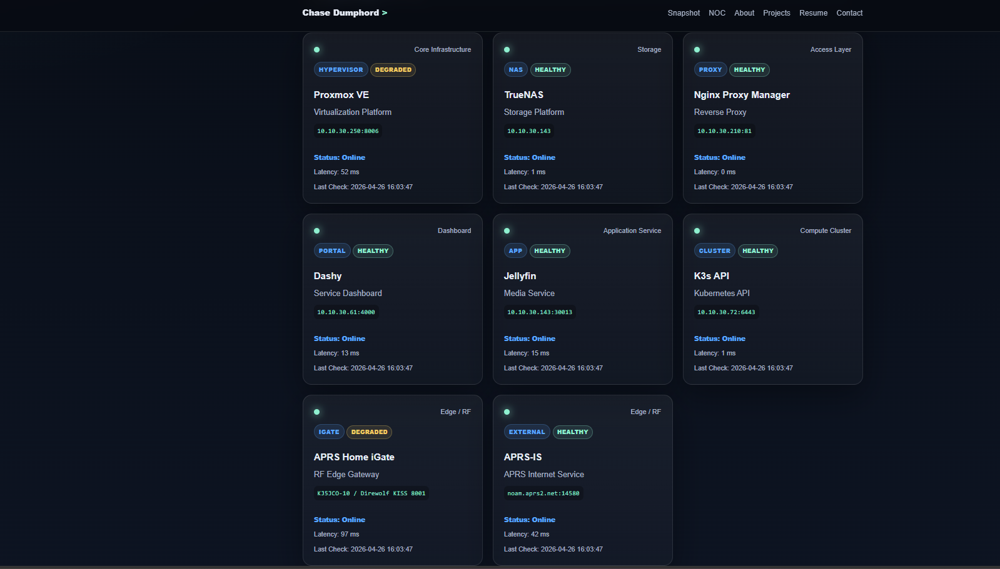
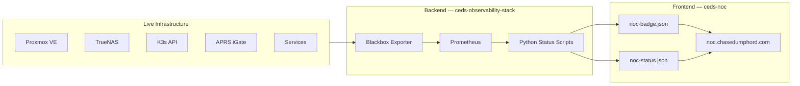
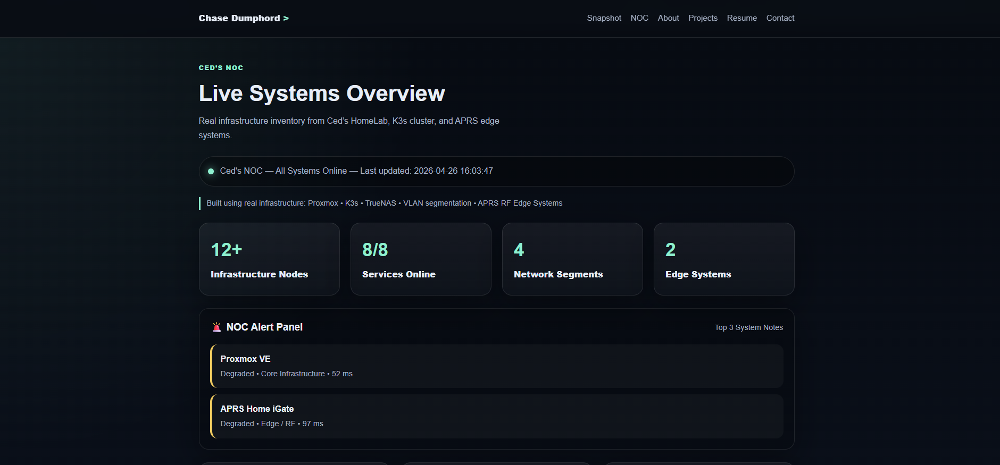

# Ced's NOC — Live Network Operations Center

> A custom-built, public-facing Network Operations Center dashboard running at [noc.chasedumphord.com](https://noc.chasedumphord.com) — providing real-time visibility into Ced's HomeLab infrastructure, services, and RF edge systems.

[](https://noc.chasedumphord.com)
[](https://chasedumphord.com)
[](#)
[](https://github.com/ced4568/ceds-observability-stack)

---

## What This Is

This is the public-facing front door to Ced's HomeLab infrastructure. This is the frontend layer of Ced's observability platform — a custom-built status page that makes live infrastructure data publicly 
accessible without requiring login. The backend engine ([ceds-observability-stack](https://github.com/ced4568/ceds-observability-stack)) handles metrics collection via Prometheus and Grafana. This repo is 
what the public sees — real-time service status, latency, and health across every layer of the homelab. no login required.

It's not a template or a third-party uptime service. It's a purpose-built frontend that pulls live status data and presents it as a professional NOC dashboard. Every card on the page represents a real, running service with real latency and uptime data.

---

## Live Dashboard

[](https://noc.chasedumphord.com)

The NOC displays real-time status for every layer of the infrastructure stack — from the Proxmox hypervisor down to the APRS RF edge system.

---

## System Coverage

### Core Infrastructure

| Service | Role | Status Source |
|---------|------|--------------|
| Proxmox VE | Hypervisor — 6-node HA cluster | TCP probe via Blackbox |
| TrueNAS | Storage platform | TCP probe via Blackbox |
| Nginx Proxy Manager | Reverse proxy | TCP probe via Blackbox |

### Application Layer

| Service | Role | Status Source |
|---------|------|--------------|
| Dashy | Service dashboard | TCP probe via Blackbox |
| Jellyfin | Media service | TCP probe via Blackbox |
| K3s API | Kubernetes cluster API | TCP probe via Blackbox |

### Edge / RF Systems

| Service | Role | Status Source |
|---------|------|--------------|
| APRS Home iGate | RF-to-internet gateway (KJ5JCO-10) | TCP probe via Blackbox |
| APRS-IS | External APRS internet service | TCP probe — noam.aprs2.net:14580 |

---

## Architecture



**Data flow:**
1. Blackbox Exporter probes all services via TCP/HTTP
2. Prometheus collects and stores probe results
3. Python scripts generate status JSON from Prometheus data
4. NOC frontend reads JSON and renders live status cards
5. Public visitors see real-time infrastructure status — no login needed

---

## Repository Structure

```
ceds-noc/
├── assets/
│   └── images/             # NOC page assets
├── data/
│   ├── noc-badge.json      # Live status badge data
│   └── noc-status.json     # Live service status data
├── screenshots/
│   ├── noc-metrics.png     # NOC metrics view
│   └── noc-systems.png     # NOC systems overview
├── scripts/
│   ├── generate-noc-badge.py   # Generates badge JSON from Prometheus
│   └── generate-noc-status.py  # Generates status JSON from Prometheus
├── index.html              # NOC frontend
├── script.js               # Status page logic
└── style.css               # NOC styling
```

---

## Status Card Design

Each service card on the NOC displays:

- **Service name and role** — what it is and what it does
- **Category badge** — HYPERVISOR, STORAGE, CLUSTER, PORTAL, etc.
- **Health badge** — HEALTHY or DEGRADED based on probe results
- **Internal IP and port** — where the service lives on the HomeLab VLAN
- **Status** — Online / Offline
- **Latency** — real response time in milliseconds
- **Last check timestamp** — when the probe last ran

This gives anyone viewing the page the same operational picture that the internal Grafana dashboard provides — without requiring access to the internal network.

---

## Screenshots

### Systems Overview — Live Service Status


### Metrics Overview


---

## Related Projects

| Project | Role |
|---------|------|
| [ceds-observability-stack](https://github.com/ced4568/ceds-observability-stack) | Backend — Prometheus, Grafana, Alertmanager, all exporters |
| [ceds-homelab](https://github.com/ced4568/ceds-homelab) | Infrastructure — Proxmox cluster, TrueNAS, networking |
| [ced-k3s-homelab](https://github.com/ced4568/ced-k3s-homelab) | Orchestration — 12-node Raspberry Pi K3s cluster |
| [ceds-aprs-igate](https://github.com/ced4568/ceds-aprs-igate) | Edge — Dual-node APRS RF-to-internet gateway |

---

## Roadmap

- [x] Live service status cards with real probe data
- [x] APRS RF edge system monitoring
- [x] Public access — no login required
- [x] Custom badge and status JSON generation
- [ ] Alerting integration — visual alerts on NOC page
- [ ] Historical uptime percentage per service
- [ ] Mobile-optimized layout
- [ ] Auto-refresh with configurable interval
- [ ] Public Grafana dashboard embed

---

## Author

**Chase Dumphord (Ced)**
Digital Systems Engineer · GE Aerospace · Oxford, MS

[](https://chasedumphord.com)
[](https://www.linkedin.com/in/chase-dumphord/)
[](https://github.com/ced4568)
[](https://noc.chasedumphord.com)
